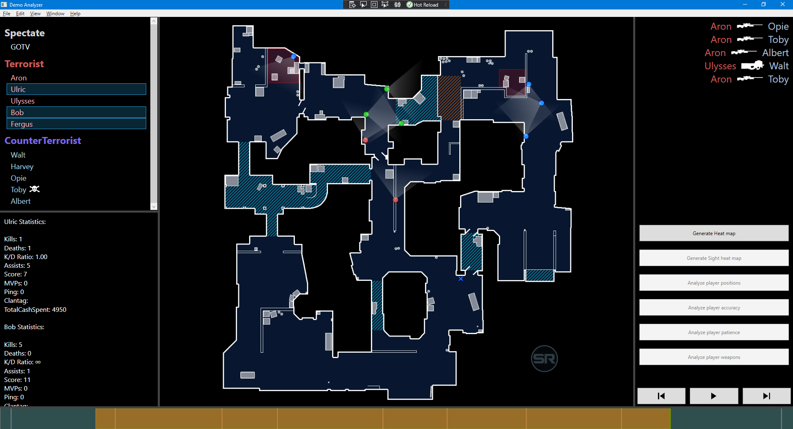
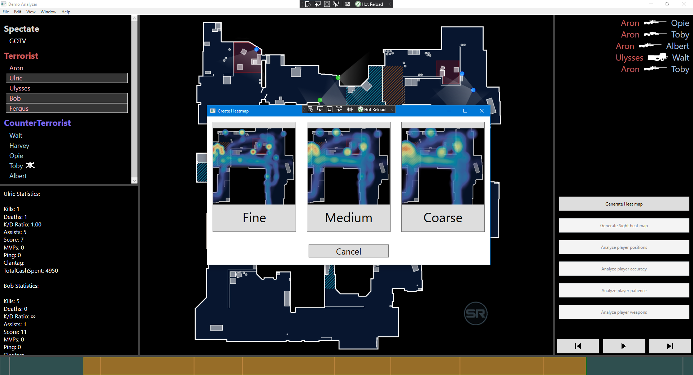
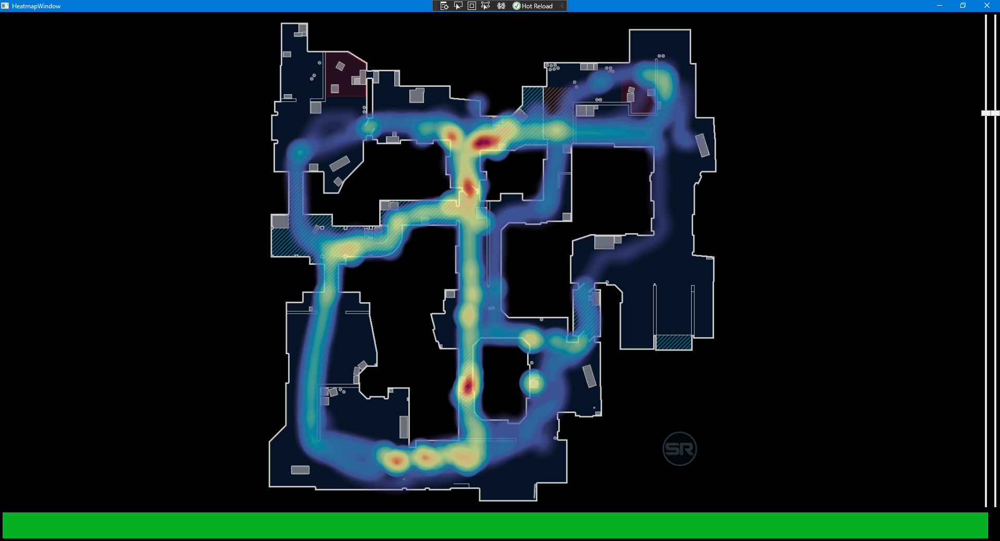

## Note: Currently in early alpha stage

# Description

A free and open-source tool aimed to simplify analyzing CS:GO demos for professional players and coaches. It is currently in its early stages so bugs are to be expected.

# Testers needed

This is done as part of an university project which conducts research on how to assist players to make better decisions and gain knowledge about their opponents to prepare for their games. If you're willing to test, please get in touch with me: hl3mukkel@gmail.com

# Screenshots

# Credits

* [Simple Radar](https://readtldr.gg/simpleradar)
* [StatsHelix/demoinfo](https://github.com/StatsHelix/demoinfo)
* [lucasb-eyer/libheatmap](https://github.com/lucasb-eyer/libheatmap)
